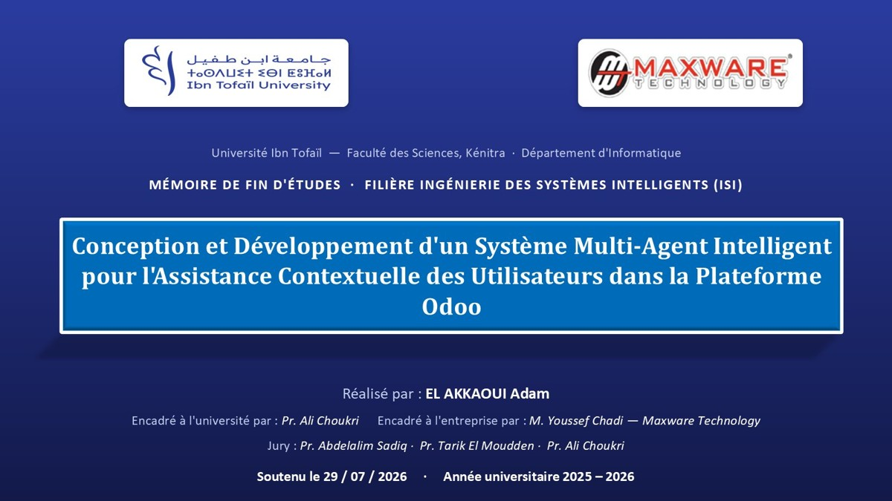

# Final-Year Intern – Intelligent Multi-Agent System for Odoo 19

[Overview](#problem-and-objectives) · [Features](#features) · [Architecture](#multi-agent-architecture) · [Stack](#odoo-integration-and-technologies) · [Demo and slides](#academic-documents-and-demonstration) · [Results](#evaluation-results) · [Limitations](#limitations-and-perspectives)

Final-year internship project carried out at Maxware Technology. The system integrates a contextual multi-agent assistant into Odoo 19 to reduce ERP learning friction, guide users directly in the interface, retrieve grounded documentation and support adaptive training.

## Problem and objectives

**Internship setting.** Maxware Technology hosted this final-year project in Kénitra, Morocco, from March to July 2026 in a hybrid arrangement. My role covered requirements analysis, architecture, implementation, integration, testing and evaluation. The assistant was designed to support users inside their ERP workflow.

The report identifies a steep ERP learning curve, dense navigation, fragmented documentation, limited contextual help and reactive support. The project addresses those issues through five documented capabilities: interface-aware assistance, visual step-by-step guidance, adaptive learning, documentation retrieval, and multilingual/voice interaction.

*C4 system context of the project.*

## Features

- Floating OWL assistant with text chat, Markdown rendering and a 2D avatar.
- Context capture from the active Odoo page, form and displayed errors.
- Visual guidance using highlights, anchored tooltips and animated arrows.
- Read-only demonstration sequences with explicit step confirmation.
- Error diagnosis linked to relevant assistance and documentation.
- Adaptive quizzes and learning paths using the SM-2 spaced-repetition model.
- Multilingual responses, browser speech input/output and proactive suggestions.
- Administration views for configuration, avatar customization, insights, learning progress and agent supervision.
- End-to-end Server-Sent Events (SSE) for pipeline status and streamed response tokens.

## Multi-agent architecture

The system is organized around eight specialized agents:

| Agent | Responsibility |
|---|---|
| OrchestratorAgent | Intent routing and coordination through a LangGraph state graph |
| ContextAgent | UI/DOM and user-context analysis |
| GuideAgent | Explanations, visual guidance and demonstrations |
| DocAgent | RAG documentation retrieval and video recommendations |
| LearnAgent | Quizzes, learning paths and SM-2 progress |
| LangAgent | Language detection, translation and voice-related assistance |
| AnalyticsAgent | Usage telemetry and friction analysis |
| PredictAgent | Navigation-aware proactive suggestions |

*C4 container architecture of the project.*

## Orchestration and information flow

The OWL frontend sends requests through an Odoo server-side proxy rather than contacting the AI backend directly. The proxy preserves the Odoo session and access-control boundary, enriches the request context and relays JSON or SSE responses to a FastAPI gateway.

The gateway validates the request context and passes it to the orchestrator. Deterministic short-circuits handle explicit guidance, quiz, demonstration and informal-conversation intents; other flows move through the LangGraph state graph. Specialized agents exchange structured state, while Redis is described for cache, sessions and publish/subscribe communication. The response is streamed back through the same proxy to the OWL widget.

## Documentation retrieval

The RAG pipeline uses official Odoo documentation and selected video resources. Sentence Transformers generate embeddings stored in ChromaDB; retrieval includes French-to-English transliteration, relevance thresholds and reranking. DocAgent returns ranked sources for grounded answers, while GuideAgent can combine retrieved material with interface steps. 

## Odoo integration and technologies

- **Odoo layer:** Odoo 19, OWL, JavaScript, SCSS, Odoo HTTP controllers and ORM.
- **Backend:** Python 3.11, FastAPI, Uvicorn, Pydantic, LangChain and LangGraph.
- **Retrieval/data:** ChromaDB, Sentence Transformers, Redis and Odoo/PostgreSQL.
- **Model providers:** NVIDIA NIM by default, with configurable OpenAI, Azure and Ollama integrations and circuit-breaker handling.
- **Interface/services:** SSE, Web Speech API, Lottie, YouTube Data API and optional translation services.
- **Engineering stack:** Docker, Kubernetes, Nginx, Prometheus, GitHub Actions, pytest and Playwright.

## Academic documents and demonstration

### Demonstration

[Open the project demonstration](https://github.com/adamelakkaoui/final-year-intern-intelligent-multi-agent-system-for-odoo-19/releases/tag/academic-demo)

### Defence presentation

*Defence presentation cover. Click to open the 19-slide PowerPoint presentation.*

- [Complete French final-year report (PDF, 81 pages)](docs/academic-report-fr.pdf).
- [French defence presentation (PPTX, 19 slides)](presentations/odoo-mas-defense-fr.pptx).
- [Project demonstration (GitHub Release)](https://github.com/adamelakkaoui/final-year-intern-intelligent-multi-agent-system-for-odoo-19/releases/tag/academic-demo).

## Evaluation results

The project evaluation includes:

- **294 automated tests** executed in continuous integration with **67% code coverage**.
- **Five end-to-end Playwright workflows** validated in a real browser.
- A RAG evaluation over **65 question/document pairs across 12 Odoo modules**, with global **Precision@5 = 0.843** and **MRR = 0.973**.
- The documentation corpus contains **4,405 segments**.
- The first SSE signal is approximately **0.2 s**.
- Explicit guidance was optimized from roughly **9–14 s** to **3.4–5.5 s**.
- Repeated document queries become almost instantaneous with Redis caching.

## Limitations and perspectives

The final report identifies the following limitations and improvement directions:

- **Quiz generation:** producing around eight structured questions remains a relatively long LLM call, approximately **8–15 s**. Because the result is structured JSON, it is not streamed token by token; the interface instead displays the generation stages.
- **Multilingual embeddings:** a multilingual embedding model was tested but required about five times more memory, increased latency and did not improve retrieval compared with the French-to-English glossary approach. The architecture still allows switching models through configuration and re-indexing.
- **Odoo Enterprise validation:** the module is compatible by design, while the full validation campaign was carried out on Odoo Community; dedicated Enterprise testing remains a future step.
- **Load testing:** Kubernetes autoscaling from two to six replicas is designed from single-instance measurements. A future k6 or Locust campaign is proposed to characterize latency under concurrent load.
- **Out-of-scope functions:** offline mode, Slack/Teams integration and advanced cloud text-to-speech remain future extensions.

The report concludes that the five internship objectives were achieved, all eight specified agents were implemented, and the expected project deliverables were completed.

## Author and credits

- Adam El Akkaoui — final-year intern and author of the academic report and defence material.

Academic supervision: Pr. Ali Choukri. Company supervision: Youssef Chadi, Maxware Technology.
