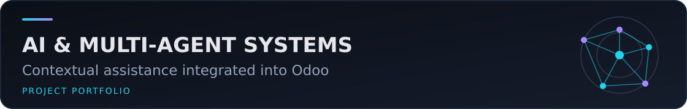
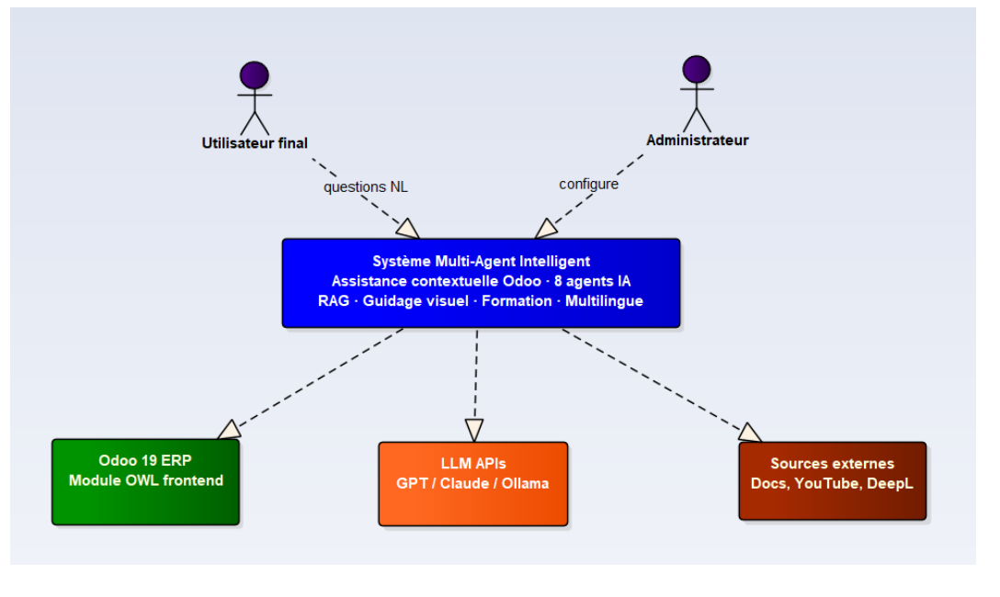
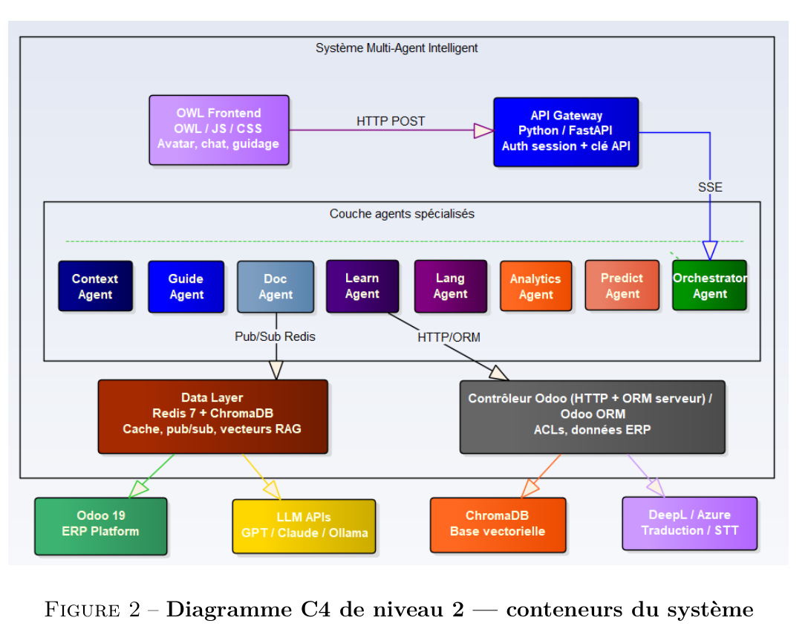

# Final-Year Intern – Intelligent Multi-Agent System for Odoo 19

Academic documentation of a final-year internship project carried out at Maxware Technology. The documented system integrates a contextual multi-agent assistant into Odoo 19 to reduce ERP learning friction, guide users directly in the interface, retrieve grounded documentation and support adaptive training.

This public repository contains reviewed academic evidence only. The professional implementation, internal guides, deployment configuration, company data and original Git history are not published.

## Problem and objectives

The report identifies a steep ERP learning curve, dense navigation, fragmented documentation, limited contextual help and reactive support. The project addresses those issues through five documented capabilities: interface-aware assistance, visual step-by-step guidance, adaptive learning, documentation retrieval, and multilingual/voice interaction.

*C4 system context extracted from the public academic report.*

## Documented features

- Floating OWL assistant with text chat, Markdown rendering and a 2D avatar.
- Context capture from the active Odoo page, form and displayed errors.
- Visual guidance using highlights, anchored tooltips and animated arrows.
- Read-only demonstration sequences with explicit step confirmation.
- Error diagnosis linked to relevant assistance and documentation.
- Adaptive quizzes and learning paths using the SM-2 spaced-repetition model.
- Multilingual responses, browser speech input/output and proactive suggestions.
- Administration views for configuration, avatar customization, insights, learning progress and agent supervision.
- End-to-end Server-Sent Events (SSE) for pipeline status and streamed response tokens.

## Multi-agent architecture

The academic documents specify eight agents:

| Agent | Documented responsibility |
|---|---|
| OrchestratorAgent | Intent routing and coordination through a LangGraph state graph |
| ContextAgent | UI/DOM and user-context analysis |
| GuideAgent | Explanations, visual guidance and demonstrations |
| DocAgent | RAG documentation retrieval and video recommendations |
| LearnAgent | Quizzes, learning paths and SM-2 progress |
| LangAgent | Language detection, translation and voice-related assistance |
| AnalyticsAgent | Usage telemetry and friction analysis |
| PredictAgent | Navigation-aware proactive suggestions |

*C4 container diagram extracted from the public academic report.*

## Orchestration and information flow

The OWL frontend sends requests through an Odoo server-side proxy rather than contacting the AI backend directly. The report states that the proxy preserves the Odoo session and access-control boundary, enriches the request context and relays JSON or SSE responses to a FastAPI gateway.

The gateway validates the request context and passes it to the orchestrator. Deterministic short-circuits handle explicit guidance, quiz, demonstration and informal-conversation intents; other flows move through the LangGraph state graph. Specialized agents exchange structured state, while Redis is described for cache, sessions and publish/subscribe communication. The response is streamed back through the same proxy to the OWL widget.

## Documentation retrieval

The documented RAG pipeline uses official Odoo documentation and selected video resources. Sentence Transformers generate embeddings stored in ChromaDB; retrieval includes French-to-English transliteration, relevance thresholds and reranking. DocAgent returns ranked sources for grounded answers, while GuideAgent can combine retrieved material with interface steps. The repository does not include the professional corpus or vector database.

## Odoo integration and technologies

- **Odoo layer:** Odoo 19, OWL, JavaScript, SCSS, Odoo HTTP controllers and ORM.
- **Backend:** Python 3.11, FastAPI, Uvicorn, Pydantic, LangChain and LangGraph.
- **Retrieval/data:** ChromaDB, Sentence Transformers, Redis and Odoo/PostgreSQL.
- **Model providers described by the report:** NVIDIA NIM by default, with configurable OpenAI, Azure and Ollama integrations and circuit-breaker handling.
- **Interface/services:** SSE, Web Speech API, Lottie, YouTube Data API and optional translation services.
- **Engineering stack reported:** Docker, Kubernetes, Nginx, Prometheus, GitHub Actions, pytest and Playwright.

## Academic documents and demonstration

- [French final-year report (PDF, 80 pages)](docs/academic-report-fr.pdf) — the supplied reduced copy omits its administrative cover page.
- [French defence presentation (PPTX, 19 slides)](presentations/odoo-mas-defense-fr.pptx).
- [Privacy-redacted demonstration (GitHub Release)](https://github.com/adamelakkaoui/final-year-intern-intelligent-multi-agent-system-for-odoo-19/releases/tag/academic-demo) — ERP, customer and contact areas are blurred while the assistant panel remains visible.

## Reported evaluation

The following values are claims documented in the report and defence slides; they were **not independently reproduced** during portfolio preparation:

- 289 of 294 local pytest cases reported as passed, with five skipped when Redis was unavailable; the documents also summarize 294 CI tests and 67% overall coverage.
- Five end-to-end Playwright flows reported as validated.
- A RAG evaluation over 65 question/document pairs and 12 modules, reporting global Precision@5 `0.843` and MRR `0.973`; CRM is reported below the target at `0.667`.
- Reported first SSE signal near `0.2 s`, near-zero repeated-document queries with Redis caching, explicit guidance reduced to `3.4–5.5 s`, and quiz generation remaining at `8–15 s`.

## Testing and limitations

Portfolio preparation verified that the report and presentation open and are extractable, reviewed their metadata and content, and extracted the two diagrams above from the public report. The redacted video was sampled across its duration after re-encoding; ERP/contact regions remain blurred. Its audio track measures approximately `-91 dB` maximum and mean volume, effectively silent, so it does not expose spoken information. The application itself, its reported tests, RAG corpus, latency measurements and business workflows were not rerun because the professional source and infrastructure are deliberately excluded.

The report itself records untested load scaling, pending Odoo Enterprise certification, CRM retrieval below target and relatively slow quiz generation. The 4K source recording remains excluded as redundant and unredacted. Internal user/administration guides and all professional code remain excluded because public-sharing rights were not established.

## Author and credits

- Adam El Akkaoui — final-year intern and author of the academic report and defence material.

Academic supervision: Pr. Ali Choukri. Company supervision acknowledged in the report: Youssef Chadi, Maxware Technology. Company and third-party names are used only to describe the documented internship context; no ownership or licence is asserted.
